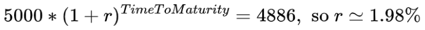

# Computing-IM-with-Prisma

What’s in a box?

This article explains how to save money on your listed derivatives portfolio by using an option combination called BOX.

When you trade listed derivatives, the exchange asks you to post a collateral as described here:
https://www.eurex.com/resource/blob/32818/179aa114c0a294159c37e54f70eab745/data/brochure_eurex-clearing-prisma.pdf

We will see two examples showing how you can reduce the cost of this collateral.

Debbie has sold an at-the-money straddle on SAP, maturity Dec23, strike 90 for 100 lots (contract size=100). 
The price of the straddle is 22EUR, so Debbie receives a total premium of 220KEUR.

	Eurex Clearing will ask for a collateral made of two components:
1/ The Mark-to-Market margin, which aims to net the Net Asset Value (NAV) of the portfolio. In this case : 220KEUR
	2/ The Initial Margin (IM), which accounts for the cost to unwind the position in an unfavorable market. This IM can be calculated using the Prisma API. 
This Git provides the Python code to compute the IM for any options portfolio. IT is based on the original doc provided by Eurex:
https://www.eurex.com/ec-en/services/margincalculators/eurexotc-clear-prisma-margincalculator/cloud-prisma-margin-estimator

In this case, the IM is 22KEUR.

So Debbie is expected to send 22KEUR in cash on top of the 220KEUR of premium which is retained by the Clearing House. But this 244KEUR cash deposit at the Clearing House will yield only a very low interest rate of 20bps below the benchmark. 

Debbie surely wants to boost this interest rate. 

The way to do this on the 1st part of the deposit (Mark-to-Market margin) is to buy a BOX for a premium of 220KEUR.

A BOX is a 4 legs combination such as this one :
1 Call on Eurostoxx50 strike 1000
1 Put on Eurostoxx50 strike 1000
1 Call on Eurostoxx50 strike 6000
1 Put on Eurostoxx50 strike 6000
(The underlying doesn’t matter, so everyone uses the Eurostoxx50).

This ‘no vega-no delta’ strategy has no impact on the portfolio’s IM, but it will be paid for using the cash collateral. This will effectively substitute the BOX implicit rate (*) to the clearing house standard rate as effective yield for the 220K.

Regarding the 22K of IM, the only way is to reduce the risk on the derivatives portfolio as measured by Prisma. The most efficient mean to this end is to neutralize the delta. In this example, the delta is already quite low since we chose an ATM straddle but with the stock moving up or down and the delta growing, it may be interesting to rebalance the quantity of calls and puts to neutralize the net delta and get the target overall delta with the stock position.

Let’s now consider Mike who was the buying party in Debbie’s trade. 
Mike will pay the premium of 220KEUR and be asked for an IM of 17KEUR.
(NB: As you can see the IM is not the same for the buyer and seller)

Mike can free up some cash by selling a BOX, which is interesting if Mike’s funding cost is above the BOX rate.
To do this, he can sell a BOX for a total premium of 220KEUR. This will allow him to receive the corresponding cash and reduce his total cash deposit to the IM (17KEUR).

So, what is the BOX rate ?
In the end, the BOX price is a market price set on the BOX by all the Debbies and Mikes in the market.
The BOX rate is derived from the BOX price which is akin to a Zero-Coupon Bond.
For example, a price of 4886 points for the Dec2023 BOX translates into an interest rate of:

The BOX rate is a useful notion in options pricing: it is the rate that you must use to discount future payoff when pricing listed options (instead of the risk free rate). This can matter a lot for high premium, long term options.

Canari can help you set up a strategy to efficiently use boxes to manage your collateral.

Canari.dev is powered by Deutsche Boerse's A7 Analytics platform.

